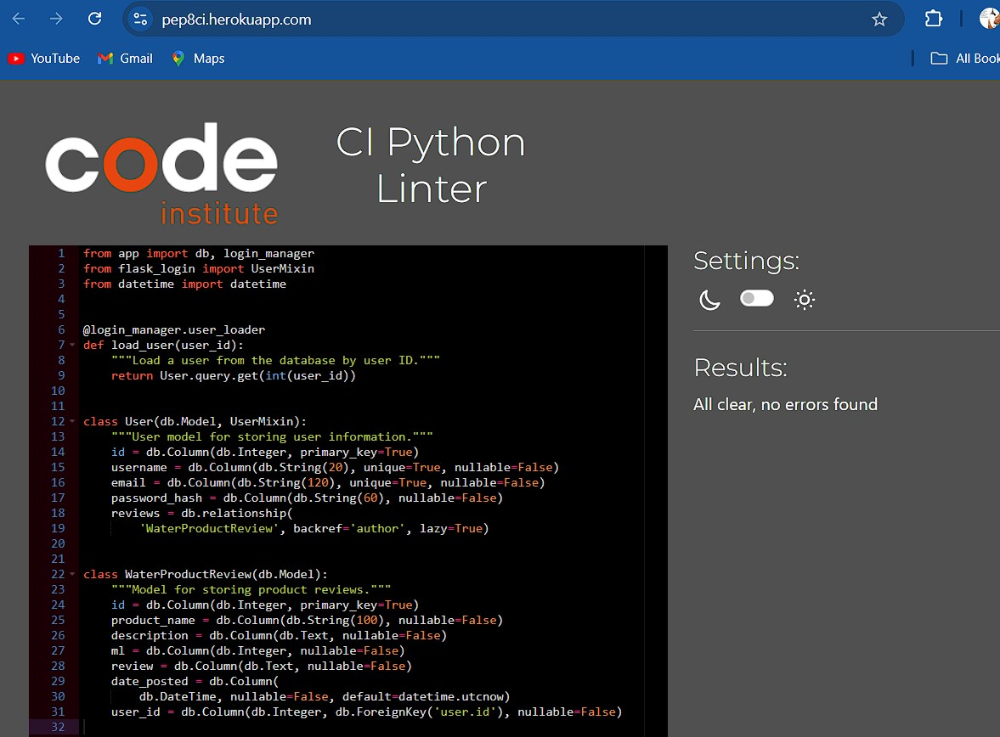

# Water Product Review

[View the live site here.](https://water-master-769e91fb66d4.herokuapp.com/)

Water Product Review is a comprehensive web platform where users can discover, review, and discuss various water-related products. The site allows users to explore a wide range of products, from water purifiers and filters to bottled water brands and eco-friendly water containers. Users can also share their experiences, rate products, and contribute to a community-driven resource for making informed water product choices.

## UX

### Flow

Users start their journey on the homepage, where they are greeted with an overview of the platform and featured product reviews. The site encourages users to sign up or log in to access personalized features like submitting reviews, saving favorite products, and interacting with other community members.

The **About** page, accessible from the main navigation, provides detailed information about the platform’s purpose, highlighting the importance of informed choices when it comes to water-related products. This page serves to educate users on how the platform can help them make better purchasing decisions.

Users who are not logged in can still browse the site, but they are prompted to register or log in when they try to submit a review or rate a product. Upon logging in, users are directed to their personal dashboard, where they can manage their reviews, update reviews, and view a list of their favorite product reviews.

### Colour Scheme

The color scheme reflects the theme of water, using shades of blue and green to evoke a sense of freshness and cleanliness. These colors also help create a visually calming environment, which is essential for users looking to make thoughtful, informed decisions.

The color palette was generated using [coolors.co](https://coolors.co).

### Typography

- **[Roboto](https://fonts.google.com/specimen/Roboto)** is used for headings and body text, chosen for its modern and clean design that ensures readability.
- **[Lato](https://fonts.google.com/specimen/Lato)** is used for secondary text, providing a complementary style that enhances the overall aesthetic.
- **[Font Awesome](https://fontawesome.com)** icons are integrated throughout the site for visual cues, buttons, and interactive elements.

## User Stories

### First Time Users

- As a first-time user, I want to understand the platform's purpose to decide if it meets my needs.
- As a first-time user, I want to browse water products easily to find items of interest.
- As a first-time user, I want clear instructions on how to sign up and the benefits of doing so.
- As a first-time user, I want to see popular products and user reviews to get a sense of community engagement.
- As a first-time user, I want to search for specific products or categories to quickly find relevant items.

### Returning Site Users

- As a returning user, I want to quickly log in to access my dashboard and manage my reviews.
- As a returning user, I want to submit new reviews and rate products based on my experiences.
- As a returning user, I want to see an updated list of top-rated and trending products to stay informed.
- As a returning user, I want to easily navigate the site to explore new products and read recent reviews.
- As a returning user, I want to update my profile and manage my account settings with ease.

### Admin

- As the site admin, I want to view and manage all user accounts to maintain site security and content quality.
- As the site admin, I want to review and approve user-submitted products and reviews to ensure they meet site standards.
- As the site admin, I want to monitor site activity and user engagement to identify areas for improvement.

## Wireframes

Wireframes were created for different device sizes using [Figma](https://www.figma.com/). The design evolved during the development process, with some features adjusted for better usability.

## Features

### Existing Features

- **Responsive Navbar**

  The navbar is designed to provide easy access to all major sections of the site, with links displayed based on the user's login status. The responsive design ensures that the navbar adapts seamlessly across desktop, tablet, and mobile devices.

- **Homepage**

  The homepage serves as the introduction to the platform, featuring a welcoming design with a brief overview of the site’s purpose and links to key sections like the product catalog and user reviews.

- **User Dashboard**

  The user dashboard provides logged-in users with a personalized space where they can manage their reviews, update account settings, and track their favorite products.

 

- **About Page**

  The About page provides users with an overview of the platform's mission, values, and the community. It helps users understand the purpose behind the Water Product Review platform and encourages them to join the community.

 
## Future Features

- **Advanced Filtering and Sorting**

  Future updates may include more advanced filtering options, such as filtering by price range, brand, or eco-friendliness.

- **Community Forum**

  A community forum could be added to allow users to discuss water-related topics, ask questions, and share tips and advice.

- **Mobile App**

  A mobile app could be developed to enhance user accessibility and provide a more streamlined experience on mobile devices.

## Technologies Used

- **HTML5** and **CSS3** for structuring and styling the web pages.
- **JavaScript** for interactive features and dynamic content.
- **Python (Flask)** for the backend framework.
- **ProgreSQL** for the database to store user data, reviews, and product information.
- **Bootstrap** for responsive design and layout.
- **jQuery** for DOM manipulation and event handling.
- **Font Awesome** for icons.
- **Google Fonts** for typography.

## Testing

Extensive testing was conducted to ensure that the site works as intended across different devices and browsers. All interactive elements were tested for functionality, and user feedback was incorporated into final adjustments.

![HTML] (documentation/images/Test_1.png)

### Issues

- **Browser Compatibility**
  - Resolved minor layout issues on older versions of Internet Explorer.
  
- **Responsive Design**
  - Adjusted the mobile layout to ensure all content is accessible and properly formatted on small screens.

## Deployment

The site is deployed on [Heroku](https://www.heroku.com/). Instructions for deploying the project locally are as follows:

1. Clone the repository.
2. Install dependencies using `pip install -r requirements.txt`.
3. Set up the ProgreSQL database by running the migration scripts.
4. Start the Flask server with `python run.py`.
5. Access the site locally via `http://localhost:5000`.

## Credits

- **Images**: Product images were sourced from [Unsplash](https://unsplash.com/) and [Pexels](https://www.pexels.com/).
- **Icons**: All icons are provided by [Font Awesome](https://fontawesome.com/).
- **Color Palette**: The color scheme was created using [Coolors](https://coolors.co/).

## Acknowledgments

I would like to thank my Code Institute mentor Iuliia Konovalova for her support with the development of the project and for encouraging me to push myself to see what I could achieve with this app.
I would like to thank the Code Institute for the useful tutorials and guidance provided to help with this project.
I would like to thank my family for being supportive.

